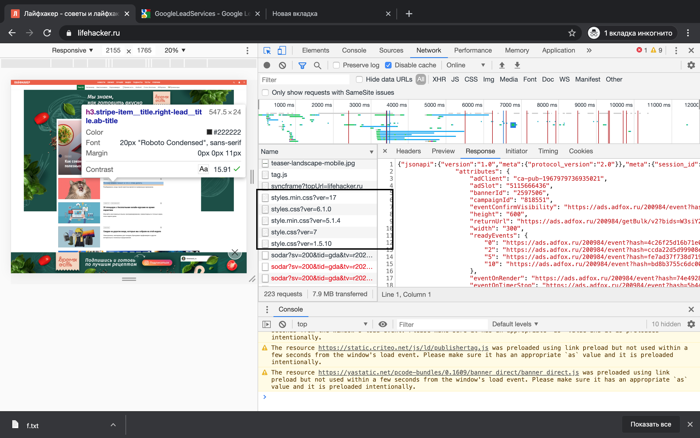
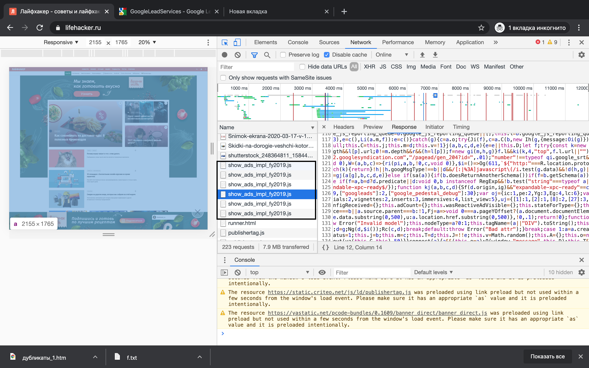
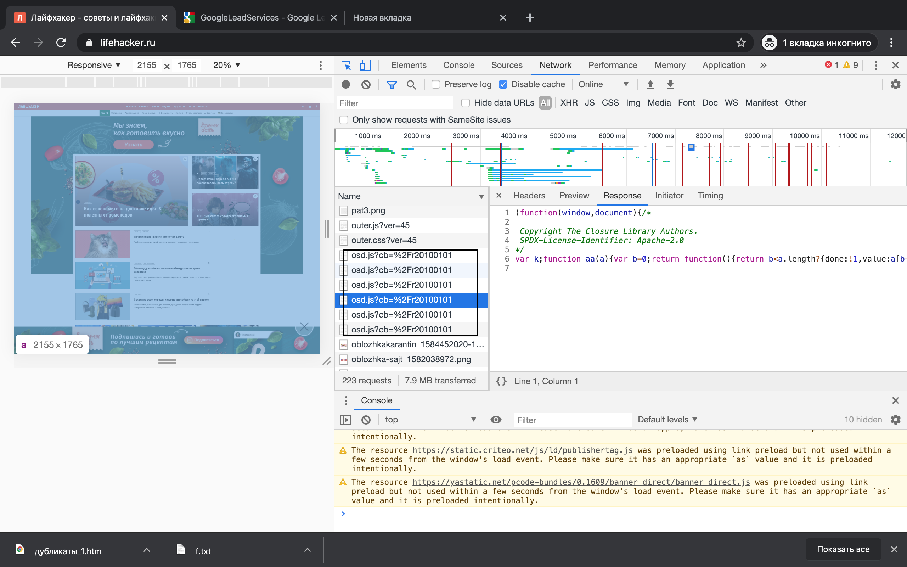
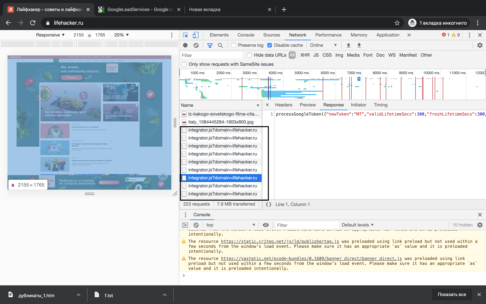
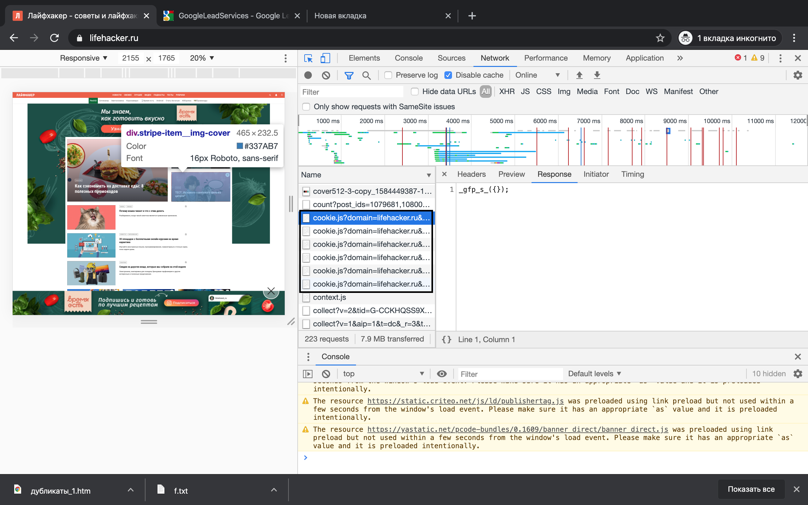
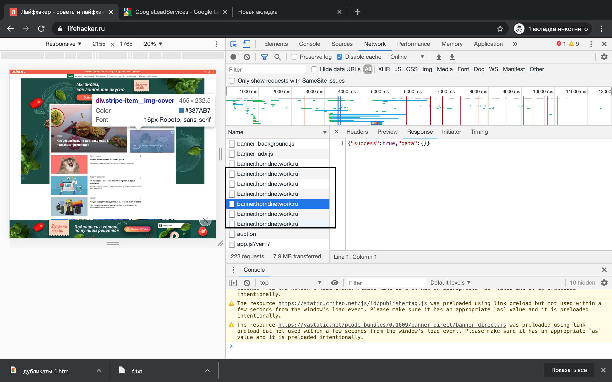
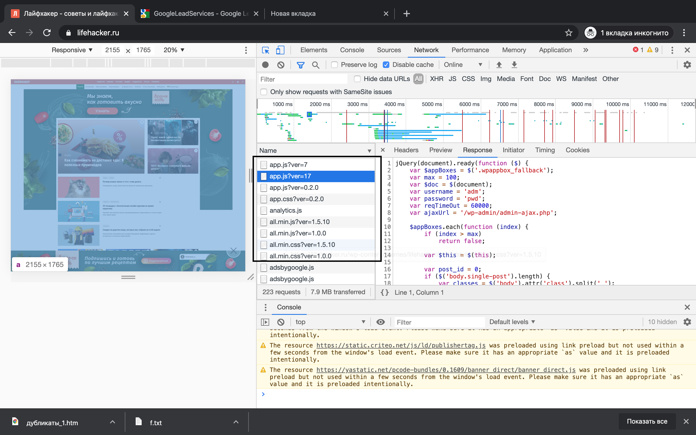
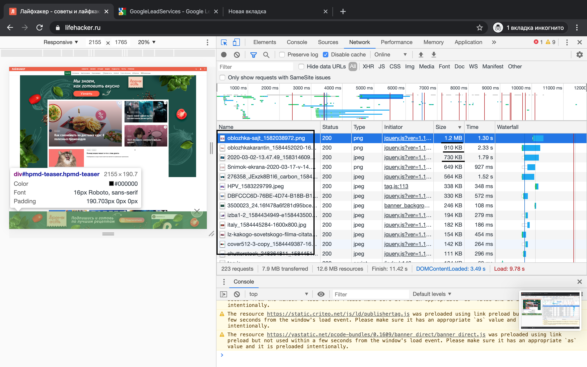
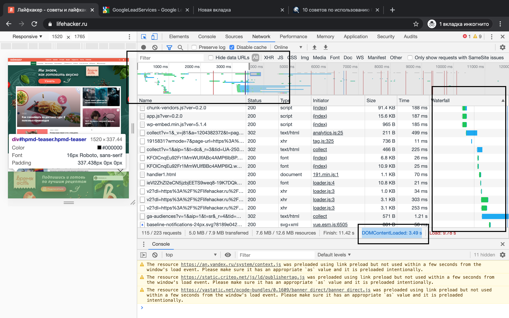
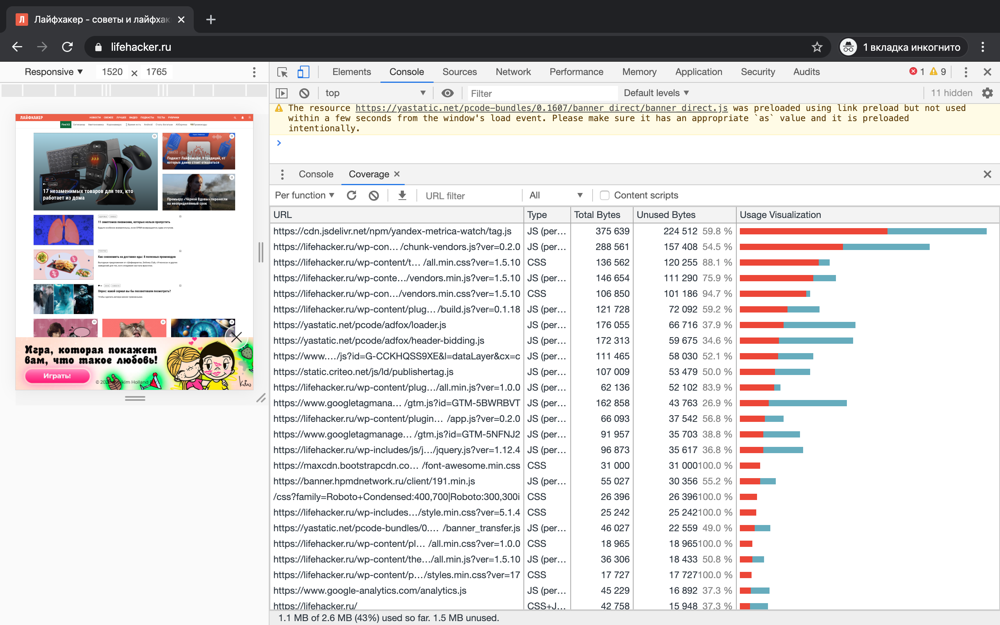

# shri-hw-tooling

Архив с har файлом закинул в корень проекта
- # Неоптимальные места (вкладка Network)
  Профиль загрузки ресурсов сохранил в файле `lifehacker.ru.har`
  Начал смотреть по столбцу `waterfall` в devtools. Первое что бросается в глаза - картинки загружаются по несколько секунд (это заметно даже без DevTools), также долго подгружаются скрипты google analytica
  - ## Дублирование ресурсов
    - Отсортировал таблицу по столбцу `Name`. Сразу бросились в глаза файлы `show_ads_impl_fy2019.js` - 6 штук и вроде как у них одинаковый repsonse. 
    - Также дублируются файлы google analytica с названием `osd.js?cb=%2Fr20100101`.
    - Есть ощущение, что загружаются сразу несколько видом библиотеки jQuery - т.е. встречаются файлики `jquery.lazy.min.js?ver=1.5.10`, `jquery.js?ver=1.12.4` и `jquery-migrate.min.js?ver=1.4.1`.
    - Встречаются много файлов с js кодом вызова рекламы гугла а также конфигурации googletagmanager разной версии и какие то файлы сайта adfox
    - Еще js и css код сайта разных версий `app.js?ver=7` `app.js?ver=17` `app.js?ver=0.2.0` `app.css?ver=0.2.0` `all.min.js?ver=1.5.10` `all.min.css?ver=1.5.10` и другие.
    
    
    
    
    
    
    
  - ## Лишний размер ресурсов
    Отсортировал таблицу по столбцу size и сразу видно что картинки являются самыми объемными ресурсами на странице, по идее их можно сжать и существенно оптимизировать загрузку.
    
  - ## Медленно загружающиеся ресурсы
    Те же самые картинки, которые можно пожать.
  - ## ресурсы, блокирующие загрузку
    Посмотрел на значение `DOMContentLoaded: 3.49 s`, на временной шкале отмерил примерно этот интервал и посмотрел, что есть в табличке В основном это js и css файлы, но встречаются также и картинки.
    

- # Вкладка perfomance
  Профиль загрузки страницы `perfomance-profile.json`
  - ## Время в миллисекундах от начала навигации до событий
    - First Paint - 1066.6 ms
    - First Meaningful Paint - 1066.6 ms
    - DOM Content Loaded - 4042.7 ms
    - Load - 7906.9 ms
  - ## Сколько времени в миллисекундах тратится на разные этапы обработки документа
    - Loading - 151 ms
    - Scripting - 3357 ms
    - Rendering - 1562 ms
    - Painting - 182 ms

- # Вкладка Coverage
  - Скриншот страницы
    
  - объём неиспользованного CSS в ходе загрузки страницы - 390KB
  - объём неиспользованного JS в ходе загрузки страницы - 1100KB

- # Perfomance при 4x CPU slowdown
  Профиль загрузки страницы `perfomance-profile-2.json`
  - ## Время в миллисекундах от начала навигации до событий
    - First Paint - 7233.7 ms
    - First Meaningful Paint - 7233.7 ms
    - DOM Content Loaded - 10530.4 ms
    - Load - 15835.7 ms
  - ## Сколько времени в миллисекундах тратится на разные этапы обработки документа
    - Loading - 167 ms
    - Scripting - 4145 ms
    - Rendering - 2030 ms
    - Painting - 415 ms

- # Perfomance при 4x CPU slowdown
  Профиль загрузки страницы `perfomance-profile-4x-cpu.json`
  - ## Время в миллисекундах от начала навигации до событий
    - First Paint - 9958.6 ms
    - First Meaningful Paint - 9958.6 ms
    - DOM Content Loaded - 28794.3 ms
    - Load - 48154.4 ms
  - ## Сколько времени в миллисекундах тратится на разные этапы обработки документа
    - Loading - 120 ms
    - Scripting - 3700 ms
    - Rendering - 1845 ms
    - Painting - 753 ms